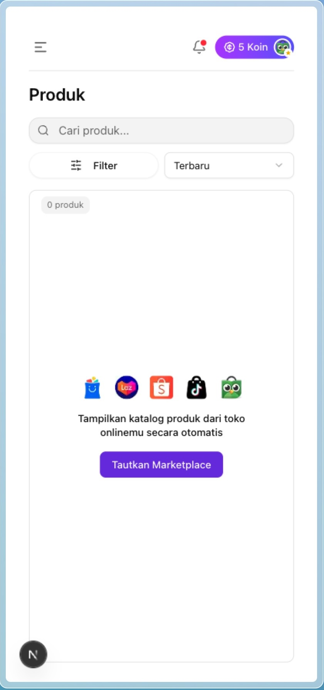
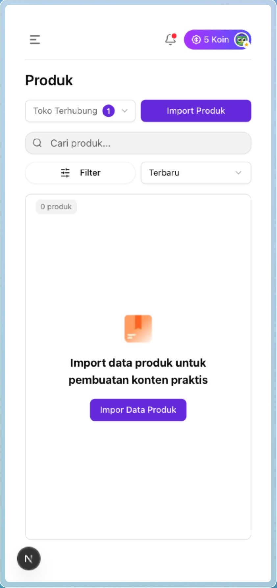
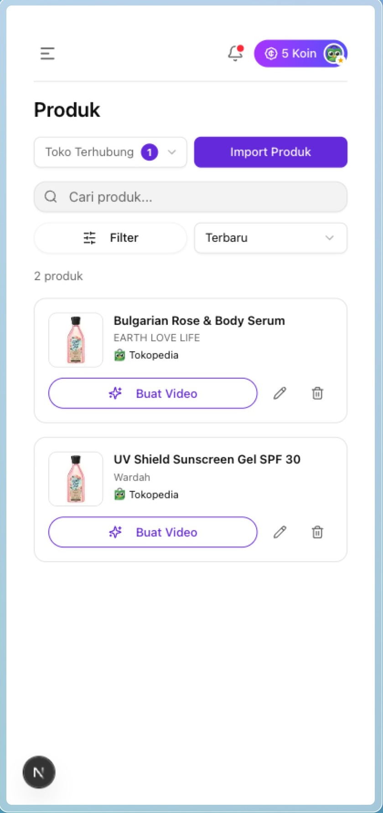

# Videfly Product Showcase Page

This is a **mobile-first, responsive product showcase page** built with [Next.js](https://nextjs.org), designed as part of the **Videfly Tech Quest 2025**. The page simulates an interface for managing AI-generated video ads based on product data from multiple marketplaces.

## ✨ Features

- Mobile-first responsive layout
- Connect to multiple marketplaces
- Import simulated product data
- Display connected stores
- Show product info with marketplace badge
- Action buttons: Generate Video, Edit, Delete
- Clean and minimal UI 

## 📦 Tech Stack

- [Next.js 15 App Router](https://nextjs.org)
- [Tailwind CSS](https://tailwindcss.com)
- [shadcn/ui](https://ui.shadcn.com/)
- Zustand (for state management)

## 🛠️ Getting Started

Install dependencies and run the dev server:

```bash
pnpm install
pnpm dev
```

Then open [http://localhost:3000](http://localhost:3000) in your browser.

## 📁 Project Structure

- `app/`: Main app router pages
- `components/`: Reusable UI components
- `store/`: State management
- `types/`: TypeScript interfaces
- `public/images/`: Marketplace icons & placeholders

## 📸 Demo Preview

Below is a preview of the product showcase page in action:

| Product Home | Product Import | Product Listing |
|:------------:|:--------------:| :--------------:|
| {: width="300px"} | {: width="300px"} | {: width="300px"} |


## 🚀 Deployment

Deploy easily using [Vercel](https://vercel.com), the official platform for Next.js apps.
